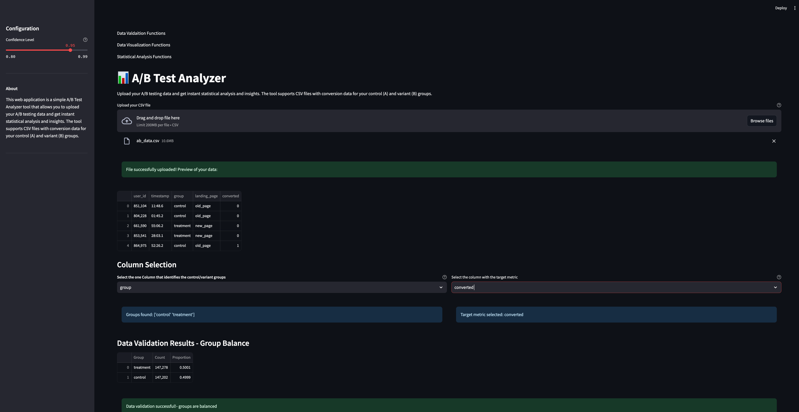
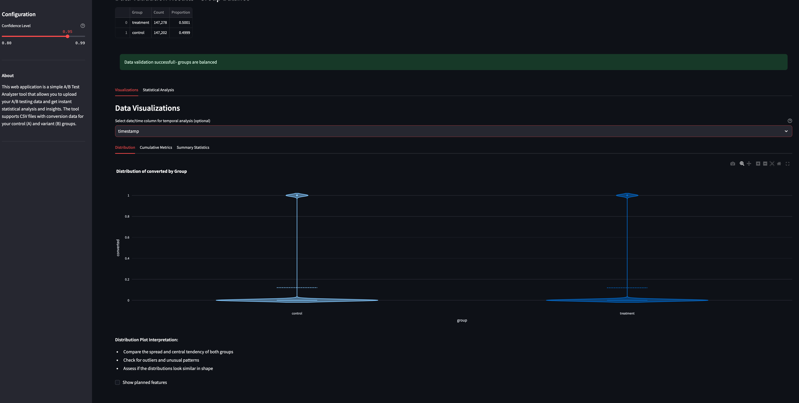
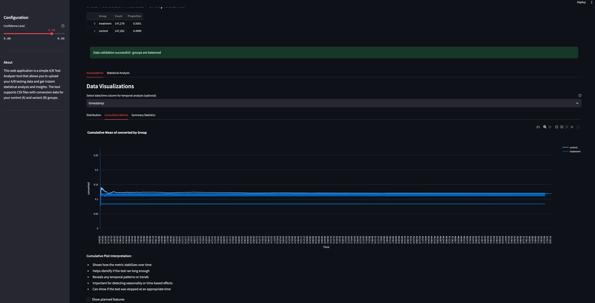
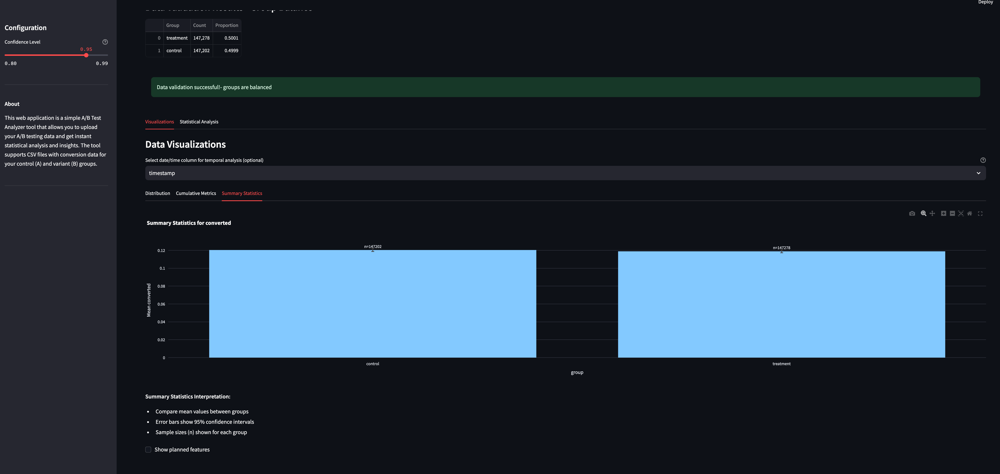
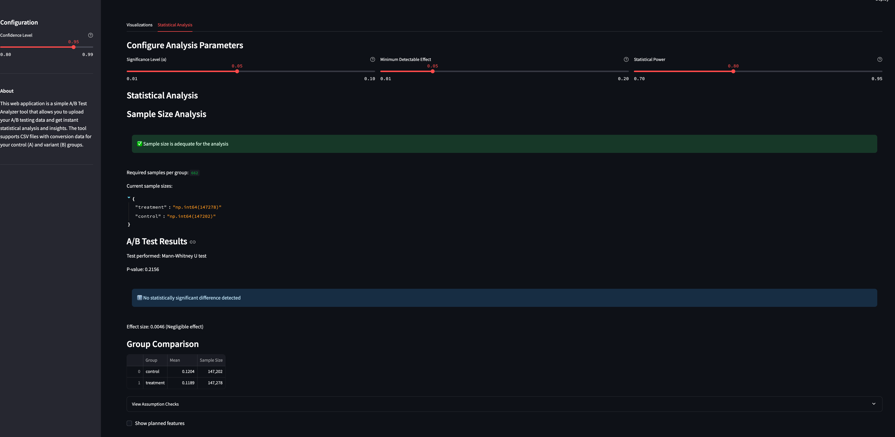

# A/B Test Analyzer

📊 **A/B Test Analyzer** is a web application that allows you to upload your A/B testing data and get instant statistical analysis and insights. The tool supports CSV files with conversion data for your control (A) and variant (B) groups.

## Features

- Upload CSV files with A/B testing data
- Instant statistical analysis and insights
- Visualizations of the data
- Configurable analysis parameters
- Group balancing and validation
- Supports time columns in `MM:SS.MS` format

## Screenshots

1. **Initial Page Load and Data Validation**


2. **Group Distribution**


3. **Cumilative Mean of the Key Metric**


4. **Summary Statistics for the Key Metric**


5. **Statistical Analysis and Conclusions**


## Installation

1. Clone the repository:
    ```sh
    git clone https://github.com/your-username/ABTesting-WebApp.git
    cd ABTesting-WebApp
    ```

2. Create a virtual environment and activate it:
    ```sh
    python -m venv .venv
    source .venv/bin/activate  # On Windows use `.venv\Scripts\activate`
    ```

3. Install the required dependencies:
    ```sh
    pip install -r requirements.txt
    ```

## Usage

1. Run the application:
    ```sh
    streamlit run ABTestingMain.py
    ```

2. Open your web browser and go to `http://localhost:8501`.

3. Upload your CSV file with A/B testing data.

4. Configure the analysis parameters and view the results.

## File Structure

- `ABTestingMain.py`: Main application file
- `requirements.txt`: List of dependencies
- `README.md`: Project documentation

## Example CSV Format

Your CSV file should have at least two columns: one for the group (control/variant) and one for the target metric. Here is an example:

```csv
group,target_metric,time
A,10,00:30.50
A,15,00:45.20
B,12,00:35.10
B,18,00:50.30